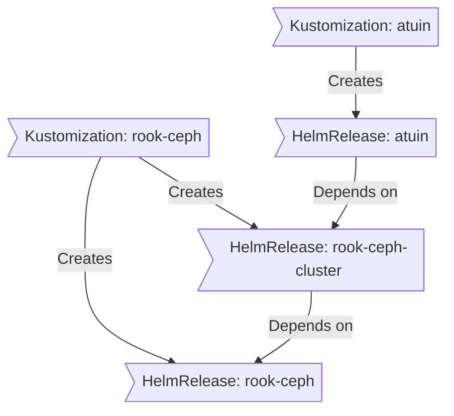

````markdown
<div align="center">


###  My Home Operations Repository 

_... managed with Flux, Renovate, and GitHub Actions_ 

</div>

<div align="center">

[](https://discord.gg/home-operations)&nbsp;&nbsp;
[](https://talos.dev)&nbsp;&nbsp;
[](https://kubernetes.io)&nbsp;&nbsp;
[](https://fluxcd.io)&nbsp;&nbsp;
[](https://github.com/onedr0p/home-ops/actions/workflows/renovate.yaml)

</div>

---

##  Overview

This is a mono repository for my home infrastructure and Kubernetes cluster. I try to adhere to Infrastructure as Code (IaC) and GitOps practices using tools like [Ansible](https://www.ansible.com/), [Terraform](https://www.terraform.io/), [Kubernetes](https://kubernetes.io/), [Flux](https://github.com/fluxcd/flux2), [Renovate](https://github.com/renovatebot/renovate), and [GitHub Actions](https://github.com/features/actions).

---

##  Kubernetes

My Kubernetes cluster is deployed with [Talos](https://www.talos.dev). This is a semi-hyper-converged cluster, workloads and block storage are sharing the same available resources on my nodes while I have a separate server with ZFS for NFS/SMB shares, bulk file storage and backups.

There is a template over at [onedr0p/cluster-template](https://github.com/onedr0p/cluster-template) if you want to try and follow along with some of the practices I use here.

---

## **Azure Key Vault (optional): Sync secrets for bootstrap**

- **Purpose**: Store local, machine-specific secrets in Azure Key Vault so you don't have to re-create `age` keys or other sensitive files each time you use a new machine.

- **Prerequisites**:
  - An existing Azure Key Vault (you must create this separately).
  - [Azure CLI](https://learn.microsoft.com/cli/azure/install-azure-cli) installed and available as `az`.
  - Your user identity must have `get`/`list`/`set` permissions for secrets in the Key Vault (or an appropriate RBAC role).

- **What this repo provides**:
  - `scripts/bootstrap.sh` — a small script that fetches secrets from Key Vault and writes them to local paths (or optionally uploads local files to Key Vault).
  - Taskfile targets in `.taskfiles/` — `template:keyvault` and `bootstrap:keyvault` which call the script or the generation task based on variables.

### Files synced with Key Vault by default

The script will look for these secret names in Key Vault and write them to the following local paths:

- `age-private-key`  -> `~/.config/sops/age/keys.txt`
- `kubeconfig`       -> `~/.kube/config`
- `github-deploy-key`-> `~/.ssh/github-deploy.key`
- `github-deploy-key-pub` -> `~/.ssh/github-deploy.key.pub`
- `github-push-token`-> `~/.config/home-ops/github-push-token.txt`
- `cloudflare-tunnel`-> `~/.cloudflared/tunnel.json`
- `cluster-yaml`     -> `./cluster.yaml` (repo root)
- `nodes-yaml`       -> `./nodes.yaml` (repo root)

These names are defaults in the script; you can adapt the script if you prefer different secret names or destinations.

### Usage (interactive SSO)

1. Ensure `az` is installed.
2. Run interactive login (SSO):

```bash
az login
```

3. Fetch secrets from Key Vault (replace `MY-VAULT`):

```bash
bash scripts/bootstrap.sh --vault MY-VAULT
```

4. To upload local files to Key Vault (for example, push your local `age` key up to the vault), use the `--upload` flag:

```bash
bash scripts/bootstrap.sh --vault MY-VAULT --upload
```

Note: If an `age` private key is missing locally and you run with `--upload`, the script will attempt to create an `age`-style keypair using `age-keygen` (if available). If `age-keygen` is not installed the script falls back to generating an RSA key with `openssl` (install `age` for proper age keypairs).

### Taskfile variables & usage

To centralize configuration, this repository adds three Taskfile variables at the root `Taskfile.yaml`:

- `VAULT_NAME` — name of the Azure Key Vault to use (empty by default)
- `USE_KEYVAULT` — `'true'` or `'false'` (string) to decide whether to fetch secrets from Key Vault or to generate locally
- `UPLOAD` — `'true'` or `'false'` (string) to enable uploading local files into the Key Vault when missing

Additionally you can disambiguate the Key Vault by specifying the resource group and subscription where it lives:

- `VAULT_RG` — resource group name containing the Key Vault (optional)
- `VAULT_SUBSCRIPTION` — subscription id or name to target (optional)
 - `VAULT_URI` — optional full vault URI (e.g. `https://myvault.vault.azure.net`) or resource id; when set this is preferred over `VAULT_NAME`.
 - `UPLOAD_ONLY` — `'true'` or `'false'` to upload existing local secrets to Key Vault and exit (no generation).

These are declared in the root `vars` so included Taskfiles inherit them. Example usages:

- Fetch secrets (interactive SSO):

```bash
VAULT_NAME=my-vault USE_KEYVAULT=true VAULT_RG=my-rg VAULT_SUBSCRIPTION=00000000-0000-0000-0000-000000000000 task template:keyvault
```

- Fetch and upload any local missing secrets to the vault:

```bash
VAULT_NAME=my-vault USE_KEYVAULT=true VAULT_RG=my-rg VAULT_SUBSCRIPTION=00000000-0000-0000-0000-000000000000 UPLOAD=true task template:keyvault
```

### Upload existing local secrets only

If you already have credentials/keys locally and want to push them into Key Vault without generating new keys, use `UPLOAD_ONLY=true`:

```bash
VAULT_NAME=my-vault VAULT_RG=my-rg VAULT_SUBSCRIPTION=00000000-0000-0000-0000-000000000000 UPLOAD_ONLY=true task template:keyvault
```

- Generate the `age` key locally using the included `generate-age-key` task (no Key Vault):

```bash
USE_KEYVAULT=false task template:keyvault
```

Notes:
- Use the `template:keyvault` task when you need to initialize templated files (it calls the template-scoped `generate-age-key` if not using Key Vault).
- The `bootstrap:keyvault` task in `.taskfiles/bootstrap` is available for bootstrap flows that expect the script to manage multiple runtime files (kubeconfig, cloudflared, etc.).

### Example using `task` (if you use the `task` runner)

```bash
task bootstrap:keyvault VAULT_NAME=MY-VAULT
# or to upload local files
task bootstrap:keyvault VAULT_NAME=MY-VAULT UPLOAD=true
```

### CI / GitHub Actions

In CI, use an Azure service principal (or managed identity in hosted runners) with permission to `get` secrets from the vault. Example step to fetch a secret and write to the sops path:

```yaml
- uses: azure/login@v2
  with:
    creds: ${{ secrets.AZURE_CREDENTIALS }}

- name: Download age key from Key Vault
  run: |
    az keyvault secret show --vault-name my-homeops-kv --name age-private-key --query value -o tsv > $HOME/.config/sops/age/keys.txt
    chmod 600 $HOME/.config/sops/age/keys.txt
```

### Security notes

- Keep Key Vault access limited to necessary principals.
- Use Key Vault's logging and monitoring to audit access.
- Do not store non-secret large state files (e.g., Terraform state) in Key Vault — use appropriate storage (Azure Storage) instead.

````
<<<<<<< HEAD
````markdown
<div align="center">


###  My Home Operations Repository 

_... managed with Flux, Renovate, and GitHub Actions_ 

</div>

<div align="center">

[](https://discord.gg/home-operations)&nbsp;&nbsp;
[](https://talos.dev)&nbsp;&nbsp;
[](https://kubernetes.io)&nbsp;&nbsp;
[](https://fluxcd.io)&nbsp;&nbsp;
[](https://github.com/onedr0p/home-ops/actions/workflows/renovate.yaml)

</div>

<div align="center">

[](https://status.turbo.ac)&nbsp;&nbsp;
[](https://status.turbo.ac)&nbsp;&nbsp;
[](https://status.turbo.ac)

</div>

<div align="center">

[](https://github.com/kashalls/kromgo)&nbsp;&nbsp;
[](https://github.com/kashalls/kromgo)&nbsp;&nbsp;
[](https://github.com/kashalls/kromgo)&nbsp;&nbsp;
[](https://github.com/kashalls/kromgo)&nbsp;&nbsp;
[](https://github.com/kashalls/kromgo)&nbsp;&nbsp;
[](https://github.com/kashalls/kromgo)&nbsp;&nbsp;
[](https://github.com/kashalls/kromgo)&nbsp;&nbsp;
[](https://github.com/kashalls/kromgo)

</div>

---

##  Overview

This is a mono repository for my home infrastructure and Kubernetes cluster. I try to adhere to Infrastructure as Code (IaC) and GitOps practices using tools like [Ansible](https://www.ansible.com/), [Terraform](https://www.terraform.io/), [Kubernetes](https://kubernetes.io/), [Flux](https://github.com/fluxcd/flux2), [Renovate](https://github.com/renovatebot/renovate), and [GitHub Actions](https://github.com/features/actions).

---

##  Kubernetes

My Kubernetes cluster is deployed with [Talos](https://www.talos.dev). This is a semi-hyper-converged cluster, workloads and block storage are sharing the same available resources on my nodes while I have a separate server with ZFS for NFS/SMB shares, bulk file storage and backups.

There is a template over at [onedr0p/cluster-template](https://github.com/onedr0p/cluster-template) if you want to try and follow along with some of the practices I use here.

### Core Components

- **Networking & Service Mesh**: [cilium](https://github.com/cilium/cilium) provides eBPF-based networking, while [istio](https://istio.io/latest/) powers service-to-service communication with L7 proxying and traffic management. [cloudflared](https://github.com/cloudflare/cloudflared) secures ingress traffic via Cloudflare, and [external-dns](https://github.com/kubernetes-sigs/external-dns) keeps DNS records in sync automatically.
- **Security & Secrets**: [cert-manager](https://github.com/cert-manager/cert-manager) automates SSL/TLS certificate management. For secrets, I use [external-secrets](https://github.com/external-secrets/external-secrets) with [1Password Connect](https://github.com/1Password/connect) to inject secrets into Kubernetes, and [sops](https://github.com/getsops/sops) to store and manage encrypted secrets in Git.
- **Storage & Data Protection**: [rook](https://github.com/rook/rook) provides distributed storage for persistent volumes, with [volsync](https://github.com/backube/volsync) handling backups and restores. [spegel](https://github.com/spegel-org/spegel) improves reliability by running a stateless, cluster-local OCI image mirror.
- **Automation & CI/CD**: [actions-runner-controller](https://github.com/actions/actions-runner-controller) runs self-hosted GitHub Actions runners directly in the cluster for continuous integration workflows.

### GitOps

[Flux](https://github.com/fluxcd/flux2) watches the clusters in my [kubernetes](./kubernetes/) folder (see Directories below) and makes the changes to my clusters based on the state of my Git repository.

The way Flux works for me here is it will recursively search the `kubernetes/apps` folder until it finds the most top level `kustomization.yaml` per directory and then apply all the resources listed in it. That aforementioned `kustomization.yaml` will generally only have a namespace resource and one or many Flux kustomizations (`ks.yaml`). Under the control of those Flux kustomizations there will be a `HelmRelease` or other resources related to the application which will be applied.

[Renovate](https://github.com/renovatebot/renovate) watches my **entire** repository looking for dependency updates, when they are found a PR is automatically created. When some PRs are merged Flux applies the changes to my cluster.

### Directories

This Git repository contains the following directories under [Kubernetes](./kubernetes/).

```sh
📁 kubernetes
├── 📁 apps       # applications
├── 📁 components # re-useable kustomize components
└── 📁 flux       # flux system configuration
```

### Flux Workflow

This is a high-level look how Flux deploys my applications with dependencies. In most cases a `HelmRelease` will depend on other `HelmRelease`'s, in other cases a `Kustomization` will depend on other `Kustomization`'s, and in rare situations an app can depend on a `HelmRelease` and a `Kustomization`. The example below shows that `atuin` won't be deployed or upgrade until the `rook-ceph-cluster` Helm release is installed or in a healthy state.


### Networking

<details>
  <summary>Click here to see my high-level network diagram</summary>

  
</details>

---

##  Cloud Dependencies

While most of my infrastructure and workloads are self-hosted I do rely upon the cloud for certain key parts of my setup. This saves me from having to worry about three things. (1) Dealing with chicken/egg scenarios, (2) services I critically need whether my cluster is online or not and (3) The "hit by a bus factor" - what happens to critical apps (e.g. Email, Password Manager, Photos) that my family relies on when I no longer around.

Alternative solutions to the first two of these problems would be to host a Kubernetes cluster in the cloud and deploy applications like [HCVault](https://www.vaultproject.io/), [Vaultwarden](https://github.com/dani-garcia/vaultwarden), [ntfy](https://ntfy.sh/), and [Gatus](https://gatus.io/); however, maintaining another cluster and monitoring another group of workloads would be more work and probably be more or equal out to the same costs as described below.

| Service                                   | Use                                                            | Cost           |
|-------------------------------------------|----------------------------------------------------------------|----------------|
| [1Password](https://1password.com/)       | Secrets with [External Secrets](https://external-secrets.io/)  | ~$65/yr        |
| [Cloudflare](https://www.cloudflare.com/) | Domain and S3                                                  | ~$50/yr        |
| [GCP](https://cloud.google.com/)          | Voice interactions with Home Assistant over Google Assistant   | Free           |
| [GitHub](https://github.com/)             | Hosting this repository and continuous integration/deployments | Free           |
| [Migadu](https://migadu.com/)             | Email hosting                                                  | ~$20/yr        |
| [Pushover](https://pushover.net/)         | Kubernetes Alerts and application notifications                | $5 OTP         |
|                                           |                                                                | Total: ~$10/mo |

---

##  DNS

In my cluster there are two instances of [ExternalDNS](https://github.com/kubernetes-sigs/external-dns) running. One for syncing private DNS records to my `UDM Pro Max` using [ExternalDNS webhook provider for UniFi](https://github.com/kashalls/external-dns-unifi-webhook), while another instance syncs public DNS to `Cloudflare`. This setup is managed by creating ingresses with two specific classes: `internal` for private DNS and `external` for public DNS. The `external-dns` instances then syncs the DNS records to their respective platforms accordingly.

---

##  Hardware

<details>
  <summary>Click here to see my server rack</summary>

  
</details>

| Device                      | Num | OS Disk Size | Data Disk Size                  | Ram  | OS            | Function                |
|-----------------------------|-----|--------------|---------------------------------|------|---------------|-------------------------|
| ASUS NUC 14 Pro CU 5 125H   | 3   | 1TB SSD      | 1TB (local) / 800GB (rook-ceph) | 96GB | Talos         | Kubernetes              |
| Dell PowerEdge T340         | 1   | 1TB SSD      | 8x22TB ZFS (mirrored vdevs)     | 64GB | TrueNAS SCALE | NFS + Backup Server     |
| JetKVM                      | 3   | -            | -                               | -    | -             | KVM for Kubernetes      |
| UniFi UDMP Max              | 1   | -            | 2x4TB HDD                       | -    | -             | Router & NVR            |
| UniFi USW-Enterprise-24-PoE | 1   | -            | -                               | -    | -             | 2.5Gb PoE Switch        |
| UniFi USP PDU Pro           | 1   | -            | -                               | -    | -             | PDU                     |
| APC SMT1500RM2U             | 1   | -            | -                               | -    | -             | UPS                     |

---

##  Stargazers

<div align="center">

<a href="https://star-history.com/#onedr0p/home-ops&Date">
  <picture>
    <source media="(prefers-color-scheme: dark)" srcset="https://api.star-history.com/svg?repos=onedr0p/home-ops&type=Date&theme=dark" />
    <source media="(prefers-color-scheme: light)" srcset="https://api.star-history.com/svg?repos=onedr0p/home-ops&type=Date" />
    
  </picture>
</a>

</div>

---

##  Gratitude and Thanks

Thanks to all the people who donate their time to the [Home Operations](https://discord.gg/home-operations) Discord community. Be sure to check out [kubesearch.dev](https://kubesearch.dev/) for ideas on how to deploy applications or get ideas on what you could deploy.

---

<div align="center">

[](https://deepwiki.com/onedr0p/home-ops)

</div>

---

## **Azure Key Vault (optional): Sync secrets for bootstrap**

- **Purpose**: Store local, machine-specific secrets in Azure Key Vault so you don't have to re-create `age` keys or other sensitive files each time you use a new machine.

- **Prerequisites**:
  - An existing Azure Key Vault (you must create this separately).
  - [Azure CLI](https://learn.microsoft.com/cli/azure/install-azure-cli) installed and available as `az`.
  - Your user identity must have `get`/`list`/`set` permissions for secrets in the Key Vault (or an appropriate RBAC role).

- **What this repo provides**:
  - `scripts/bootstrap.sh` — a small script that fetches secrets from Key Vault and writes them to local paths (or optionally uploads local files to Key Vault).
  - `Taskfile.yml` — a convenience `task` target `bootstrap:keyvault` to run the script.

### Files synced with Key Vault by default

The script will look for these secret names in Key Vault and write them to the following local paths:

- `age-private-key`  -> `~/.config/sops/age/keys.txt`
- `kubeconfig`       -> `~/.kube/config`
- `github-deploy-key`-> `~/.ssh/github-deploy.key`
- `github-deploy-key-pub` -> `~/.ssh/github-deploy.key.pub`
- `github-push-token`-> `~/.config/home-ops/github-push-token.txt`
- `cloudflare-tunnel`-> `~/.cloudflared/tunnel.json`
- `cluster-yaml`     -> `./cluster.yaml` (repo root)
- `nodes-yaml`       -> `./nodes.yaml` (repo root)

These names are defaults in the script; you can adapt the script if you prefer different secret names or destinations.

### Usage (interactive SSO)

1. Ensure `az` is installed.
2. Run interactive login (SSO):

```bash
az login
```

3. Fetch secrets from Key Vault (replace `MY-VAULT`):

```bash
bash scripts/bootstrap.sh --vault MY-VAULT
```

4. To upload local files to Key Vault (for example, push your local `age` key up to the vault), use the `--upload` flag:

```bash
bash scripts/bootstrap.sh --vault MY-VAULT --upload
```

Note: If an `age` private key is missing locally and you run with `--upload`, the script will attempt to create an `age`-style keypair using `age-keygen` (if available). If `age-keygen` is not installed the script falls back to generating an RSA key with `openssl` (install `age` for proper age keypairs).

### Example using `task` (if you use the `task` runner)

```bash
task bootstrap:keyvault VAULT_NAME=MY-VAULT
# or to upload local files
task bootstrap:keyvault VAULT_NAME=MY-VAULT UPLOAD=true
```

### CI / GitHub Actions

In CI, use an Azure service principal (or managed identity in hosted runners) with permission to `get` secrets from the vault. Example step to fetch a secret and write to the sops path:

```yaml
- uses: azure/login@v2
  with:
    creds: ${{ secrets.AZURE_CREDENTIALS }}

- name: Download age key from Key Vault
  run: |
    az keyvault secret show --vault-name my-homeops-kv --name age-private-key --query value -o tsv > $HOME/.config/sops/age/keys.txt
    chmod 600 $HOME/.config/sops/age/keys.txt
```

### Security notes

- Keep Key Vault access limited to necessary principals.
- Use Key Vault's logging and monitoring to audit access.
- Do not store non-secret large state files (e.g., Terraform state) in Key Vault — use appropriate storage (Azure Storage) instead.

````
=======
<<<<<<< HEAD
>>>>>>> 2e5f4fbc4f6ceafc3779e440628080e4dc40e1d6
<div align="center">

###  My Home Operations Repository 

_... managed with Flux, Renovate, and GitHub Actions_ 

</div>

<div align="center">

[](https://discord.gg/home-operations)&nbsp;&nbsp;
[](https://talos.dev)&nbsp;&nbsp;
[](https://kubernetes.io)&nbsp;&nbsp;
[](https://fluxcd.io)&nbsp;&nbsp;
[](https://github.com/onedr0p/home-ops/actions/workflows/renovate.yaml)

</div>

<div align="center">

[](https://status.turbo.ac)&nbsp;&nbsp;
[](https://status.turbo.ac)&nbsp;&nbsp;
[](https://status.turbo.ac)

</div>

<div align="center">

[](https://github.com/kashalls/kromgo)&nbsp;&nbsp;
[](https://github.com/kashalls/kromgo)&nbsp;&nbsp;
[](https://github.com/kashalls/kromgo)&nbsp;&nbsp;
[](https://github.com/kashalls/kromgo)&nbsp;&nbsp;
[](https://github.com/kashalls/kromgo)&nbsp;&nbsp;
[](https://github.com/kashalls/kromgo)&nbsp;&nbsp;
[](https://github.com/kashalls/kromgo)&nbsp;&nbsp;
[](https://github.com/kashalls/kromgo)

</div>

---

##  Overview

This is a mono repository for my home infrastructure and Kubernetes cluster. I try to adhere to Infrastructure as Code (IaC) and GitOps practices using tools like [Ansible](https://www.ansible.com/), [Terraform](https://www.terraform.io/), [Kubernetes](https://kubernetes.io/), [Flux](https://github.com/fluxcd/flux2), [Renovate](https://github.com/renovatebot/renovate), and [GitHub Actions](https://github.com/features/actions).

---

##  Kubernetes

My Kubernetes cluster is deployed with [Talos](https://www.talos.dev). This is a semi-hyper-converged cluster, workloads and block storage are sharing the same available resources on my nodes while I have a separate server with ZFS for NFS/SMB shares, bulk file storage and backups.

There is a template over at [onedr0p/cluster-template](https://github.com/onedr0p/cluster-template) if you want to try and follow along with some of the practices I use here.

### Core Components

- **Networking & Service Mesh**: [cilium](https://github.com/cilium/cilium) provides eBPF-based networking, while [istio](https://istio.io/latest/) powers service-to-service communication with L7 proxying and traffic management. [cloudflared](https://github.com/cloudflare/cloudflared) secures ingress traffic via Cloudflare, and [external-dns](https://github.com/kubernetes-sigs/external-dns) keeps DNS records in sync automatically.
- **Security & Secrets**: [cert-manager](https://github.com/cert-manager/cert-manager) automates SSL/TLS certificate management. For secrets, I use [external-secrets](https://github.com/external-secrets/external-secrets) with [1Password Connect](https://github.com/1Password/connect) to inject secrets into Kubernetes, and [sops](https://github.com/getsops/sops) to store and manage encrypted secrets in Git.
- **Storage & Data Protection**: [rook](https://github.com/rook/rook) provides distributed storage for persistent volumes, with [volsync](https://github.com/backube/volsync) handling backups and restores. [spegel](https://github.com/spegel-org/spegel) improves reliability by running a stateless, cluster-local OCI image mirror.
- **Automation & CI/CD**: [actions-runner-controller](https://github.com/actions/actions-runner-controller) runs self-hosted GitHub Actions runners directly in the cluster for continuous integration workflows.

### GitOps

[Flux](https://github.com/fluxcd/flux2) watches the clusters in my [kubernetes](./kubernetes/) folder (see Directories below) and makes the changes to my clusters based on the state of my Git repository.

The way Flux works for me here is it will recursively search the `kubernetes/apps` folder until it finds the most top level `kustomization.yaml` per directory and then apply all the resources listed in it. That aforementioned `kustomization.yaml` will generally only have a namespace resource and one or many Flux kustomizations (`ks.yaml`). Under the control of those Flux kustomizations there will be a `HelmRelease` or other resources related to the application which will be applied.

[Renovate](https://github.com/renovatebot/renovate) watches my **entire** repository looking for dependency updates, when they are found a PR is automatically created. When some PRs are merged Flux applies the changes to my cluster.

### Directories

This Git repository contains the following directories under [Kubernetes](./kubernetes/).

```sh
📁 kubernetes
├── 📁 apps       # applications
├── 📁 components # re-useable kustomize components
└── 📁 flux       # flux system configuration
```

### Flux Workflow

This is a high-level look how Flux deploys my applications with dependencies. In most cases a `HelmRelease` will depend on other `HelmRelease`'s, in other cases a `Kustomization` will depend on other `Kustomization`'s, and in rare situations an app can depend on a `HelmRelease` and a `Kustomization`. The example below shows that `atuin` won't be deployed or upgrade until the `rook-ceph-cluster` Helm release is installed or in a healthy state.



### Networking

<details>
  <summary>Click here to see my high-level network diagram</summary>

  
</details>

---

##  Cloud Dependencies

While most of my infrastructure and workloads are self-hosted I do rely upon the cloud for certain key parts of my setup. This saves me from having to worry about three things. (1) Dealing with chicken/egg scenarios, (2) services I critically need whether my cluster is online or not and (3) The "hit by a bus factor" - what happens to critical apps (e.g. Email, Password Manager, Photos) that my family relies on when I no longer around.

Alternative solutions to the first two of these problems would be to host a Kubernetes cluster in the cloud and deploy applications like [HCVault](https://www.vaultproject.io/), [Vaultwarden](https://github.com/dani-garcia/vaultwarden), [ntfy](https://ntfy.sh/), and [Gatus](https://gatus.io/); however, maintaining another cluster and monitoring another group of workloads would be more work and probably be more or equal out to the same costs as described below.

| Service                                   | Use                                                            | Cost           |
|-------------------------------------------|----------------------------------------------------------------|----------------|
| [1Password](https://1password.com/)       | Secrets with [External Secrets](https://external-secrets.io/)  | ~$65/yr        |
| [Cloudflare](https://www.cloudflare.com/) | Domain and S3                                                  | ~$50/yr        |
| [GCP](https://cloud.google.com/)          | Voice interactions with Home Assistant over Google Assistant   | Free           |
| [GitHub](https://github.com/)             | Hosting this repository and continuous integration/deployments | Free           |
| [Migadu](https://migadu.com/)             | Email hosting                                                  | ~$20/yr        |
| [Pushover](https://pushover.net/)         | Kubernetes Alerts and application notifications                | $5 OTP         |
|                                           |                                                                | Total: ~$10/mo |

---

##  DNS

In my cluster there are two instances of [ExternalDNS](https://github.com/kubernetes-sigs/external-dns) running. One for syncing private DNS records to my `UDM Pro Max` using [ExternalDNS webhook provider for UniFi](https://github.com/kashalls/external-dns-unifi-webhook), while another instance syncs public DNS to `Cloudflare`. This setup is managed by creating ingresses with two specific classes: `internal` for private DNS and `external` for public DNS. The `external-dns` instances then syncs the DNS records to their respective platforms accordingly.

---

##  Hardware

<details>
  <summary>Click here to see my server rack</summary>

  
</details>

| Device                      | Num | OS Disk Size | Data Disk Size                  | Ram  | OS            | Function                |
|-----------------------------|-----|--------------|---------------------------------|------|---------------|-------------------------|
| ASUS NUC 14 Pro CU 5 125H   | 3   | 1TB SSD      | 1TB (local) / 800GB (rook-ceph) | 96GB | Talos         | Kubernetes              |
| Dell PowerEdge T340         | 1   | 1TB SSD      | 8x22TB ZFS (mirrored vdevs)     | 64GB | TrueNAS SCALE | NFS + Backup Server     |
| JetKVM                      | 3   | -            | -                               | -    | -             | KVM for Kubernetes      |
| UniFi UDMP Max              | 1   | -            | 2x4TB HDD                       | -    | -             | Router & NVR            |
| UniFi USW-Enterprise-24-PoE | 1   | -            | -                               | -    | -             | 2.5Gb PoE Switch        |
| UniFi USP PDU Pro           | 1   | -            | -                               | -    | -             | PDU                     |
| APC SMT1500RM2U             | 1   | -            | -                               | -    | -             | UPS                     |

---

##  Stargazers

<div align="center">

<a href="https://star-history.com/#onedr0p/home-ops&Date">
  <picture>
    <source media="(prefers-color-scheme: dark)" srcset="https://api.star-history.com/svg?repos=onedr0p/home-ops&type=Date&theme=dark" />
    <source media="(prefers-color-scheme: light)" srcset="https://api.star-history.com/svg?repos=onedr0p/home-ops&type=Date" />
    
=======
# ⛵ Cluster Template

Welcome to my template designed for deploying a single Kubernetes cluster. Whether you're setting up a cluster at home on bare-metal or virtual machines (VMs), this project aims to simplify the process and make Kubernetes more accessible. This template is inspired by my personal [home-ops](https://github.com/onedr0p/home-ops) repository, providing a practical starting point for anyone interested in managing their own Kubernetes environment.

At its core, this project leverages [makejinja](https://github.com/mirkolenz/makejinja), a powerful tool for rendering templates. By reading configuration files—such as [cluster.yaml](./cluster.sample.yaml) and [nodes.yaml](./nodes.sample.yaml)—Makejinja generates the necessary configurations to deploy a Kubernetes cluster with the following features:

- Easy configuration through YAML files.
- Compatibility with home setups, whether on physical hardware or VMs.
- A modular and extensible approach to cluster deployment and management.

With this approach, you'll gain a solid foundation to build and manage your Kubernetes cluster efficiently.

## ✨ Features

A Kubernetes cluster deployed with [Talos Linux](https://github.com/siderolabs/talos) and an opinionated implementation of [Flux](https://github.com/fluxcd/flux2) using [GitHub](https://github.com/) as the Git provider, [sops](https://github.com/getsops/sops) to manage secrets and [cloudflared](https://github.com/cloudflare/cloudflared) to access applications external to your local network.

- **Required:** Some knowledge of [Containers](https://opencontainers.org/), [YAML](https://noyaml.com/), [Git](https://git-scm.com/), and a **Cloudflare account** with a **domain**.
- **Included components:** [flux](https://github.com/fluxcd/flux2), [cilium](https://github.com/cilium/cilium), [cert-manager](https://github.com/cert-manager/cert-manager), [spegel](https://github.com/spegel-org/spegel), [reloader](https://github.com/stakater/Reloader), [envoy-gateway](https://github.com/envoyproxy/gateway), [external-dns](https://github.com/kubernetes-sigs/external-dns) and [cloudflared](https://github.com/cloudflare/cloudflared).

**Other features include:**

- Dev env managed w/ [mise](https://mise.jdx.dev/)
- Workflow automation w/ [GitHub Actions](https://github.com/features/actions)
- Dependency automation w/ [Renovate](https://www.mend.io/renovate)
- Flux `HelmRelease` and `Kustomization` diffs w/ [flux-local](https://github.com/allenporter/flux-local)

Does this sound cool to you? If so, continue to read on! 👇

## 🚀 Let's Go!

There are **5 stages** outlined below for completing this project, make sure you follow the stages in order.

### Stage 1: Machine Preparation

> [!IMPORTANT]
> If you have **3 or more nodes** it is recommended to make 3 of them controller nodes for a highly available control plane. This project configures **all nodes** to be able to run workloads. **Worker nodes** are therefore **optional**.
>
> **Minimum system requirements**
> | Role    | Cores    | Memory        | System Disk               |
> |---------|----------|---------------|---------------------------|
> | Control/Worker | 4 | 16GB | 256GB SSD/NVMe |

1. Head over to the [Talos Linux Image Factory](https://factory.talos.dev) and follow the instructions. Be sure to only choose the **bare-minimum system extensions** as some might require additional configuration and prevent Talos from booting without it. You can always add system extensions after Talos is installed and working.

2. This will eventually lead you to download a Talos Linux ISO (or for SBCs a RAW) image. Make sure to note the **schematic ID** you will need this later on.

3. Flash the Talos ISO or RAW image to a USB drive and boot from it on your nodes.

4. Verify with `nmap` that your nodes are available on the network. (Replace `192.168.1.0/24` with the network your nodes are on.)

    ```sh
    nmap -Pn -n -p 50000 192.168.1.0/24 -vv | grep 'Discovered'
    ```

### Stage 2: Local Workstation

> [!TIP]
> It is recommended to set the visibility of your repository to `Public` so you can easily request help if you get stuck.

1. Create a new repository by clicking the green `Use this template` button at the top of this page, then clone the new repo you just created and `cd` into it. Alternatively you can us the [GitHub CLI](https://cli.github.com/) ...

    ```sh
    export REPONAME="home-ops"
    gh repo create $REPONAME --template onedr0p/cluster-template --disable-wiki --public --clone && cd $REPONAME
    ```

2. **Install** the [Mise CLI](https://mise.jdx.dev/getting-started.html#installing-mise-cli) on your workstation.

3. **Activate** Mise in your shell by following the [activation guide](https://mise.jdx.dev/getting-started.html#activate-mise).

4. Use `mise` to install the **required** CLI tools:

    ```sh
    mise trust
    pip install pipx
    mise install
    ```

   📍 _**Having trouble installing the tools?** Try unsetting the `GITHUB_TOKEN` env var and then run these commands again_

   📍 _**Having trouble compiling Python?** Try running `mise settings python.compile=0` and then run these commands again_

5. Logout of GitHub Container Registry (GHCR) as this may cause authorization problems when using the public registry:

    ```sh
    docker logout ghcr.io
    helm registry logout ghcr.io
    ```

### Stage 3: Cloudflare configuration

> [!WARNING]
> If any of the commands fail with `command not found` or `unknown command` it means `mise` is either not install or configured incorrectly.

1. Create a Cloudflare API token for use with cloudflared and external-dns by reviewing the official [documentation](https://developers.cloudflare.com/fundamentals/api/get-started/create-token/) and following the instructions below.

   - Click the blue `Use template` button for the `Edit zone DNS` template.
   - Name your token `kubernetes`
   - Under `Permissions`, click `+ Add More` and add permissions `Zone - DNS - Edit` and `Account - Cloudflare Tunnel - Read`
   - Limit the permissions to a specific account and/or zone resources and then click `Continue to Summary` and then `Create Token`.
   - **Save this token somewhere safe**, you will need it later on.

2. Create the Cloudflare Tunnel:

    ```sh
    cloudflared tunnel login
    cloudflared tunnel create --credentials-file cloudflare-tunnel.json kubernetes
    ```

### Stage 4: Cluster configuration

1. Generate the config files from the sample files:

    ```sh
    task init
    ```

2. Fill out `cluster.yaml` and `nodes.yaml` configuration files using the comments in those file as a guide.

3. Template out the kubernetes and talos configuration files, if any issues come up be sure to read the error and adjust your config files accordingly.

    ```sh
    task configure
    ```

4. Push your changes to git:

   📍 _**Verify** all the `./kubernetes/**/*.sops.*` files are **encrypted** with SOPS_

    ```sh
    git add -A
    git commit -m "chore: initial commit :rocket:"
    git push
    ```

> [!TIP]
> Using a **private repository**? Make sure to paste the public key from `github-deploy.key.pub` into the deploy keys section of your GitHub repository settings. This will make sure Flux has read/write access to your repository.

### Stage 5: Bootstrap Talos, Kubernetes, and Flux

> [!WARNING]
> It might take a while for the cluster to be setup (10+ minutes is normal). During which time you will see a variety of error messages like: "couldn't get current server API group list," "error: no matching resources found", etc. 'Ready' will remain "False" as no CNI is deployed yet. **This is a normal.** If this step gets interrupted, e.g. by pressing <kbd>Ctrl</kbd> + <kbd>C</kbd>, you likely will need to [reset the cluster](#-reset) before trying again

1. Install Talos:

    ```sh
    task bootstrap:talos
    ```

2. Push your changes to git:

    ```sh
    git add -A
    git commit -m "chore: add talhelper encrypted secret :lock:"
    git push
    ```

3. Install cilium, coredns, spegel, flux and sync the cluster to the repository state:

    ```sh
    task bootstrap:apps
    ```

4. Watch the rollout of your cluster happen:

    ```sh
    kubectl get pods --all-namespaces --watch
    ```

## 📣 Post installation

### ✅ Verifications

1. Check the status of Cilium:

    ```sh
    cilium status
    ```

2. Check the status of Flux and if the Flux resources are up-to-date and in a ready state:

   📍 _Run `task reconcile` to force Flux to sync your Git repository state_

    ```sh
    flux check
    flux get sources git flux-system
    flux get ks -A
    flux get hr -A
    ```

3. Check TCP connectivity to both the internal and external gateways:

   📍 _The variables are only placeholders, replace them with your actual values_

    ```sh
    nmap -Pn -n -p 443 ${cluster_gateway_addr} ${cloudflare_gateway_addr} -vv
    ```

4. Check you can resolve DNS for `echo`, this should resolve to `${cloudflare_gateway_addr}`:

   📍 _The variables are only placeholders, replace them with your actual values_

    ```sh
    dig @${cluster_dns_gateway_addr} echo.${cloudflare_domain}
    ```

5. Check the status of your wildcard `Certificate`:

    ```sh
    kubectl -n kube-system describe certificates
    ```

### 🌐 Public DNS

> [!TIP]
> Use the `envoy-external` gateway on `HTTPRoutes` to make applications public to the internet. These are also accessible on your private network once you set up split DNS.

The `external-dns` application created in the `network` namespace will handle creating public DNS records. By default, `echo` and the `flux-webhook` are the only subdomains reachable from the public internet. In order to make additional applications public you must **set the correct gateway** like in the HelmRelease for `echo`.

### 🏠 Home DNS

> [!TIP]
> Use the `envoy-internal` gateway on `HTTPRoutes` to make applications private to your network. If you're having trouble with internal DNS resolution check out [this](https://github.com/onedr0p/cluster-template/discussions/719) GitHub discussion.

`k8s_gateway` will provide DNS resolution to external Kubernetes resources (i.e. points of entry to the cluster) from any device that uses your home DNS server. For this to work, your home DNS server must be configured to forward DNS queries for `${cloudflare_domain}` to `${cluster_dns_gateway_addr}` instead of the upstream DNS server(s) it normally uses. This is a form of **split DNS** (aka split-horizon DNS / conditional forwarding).

_... Nothing working? That is expected, this is DNS after all!_

### 🪝 Github Webhook

By default Flux will periodically check your git repository for changes. In-order to have Flux reconcile on `git push` you must configure Github to send `push` events to Flux.

1. Obtain the webhook path:

   📍 _Hook id and path should look like `/hook/12ebd1e363c641dc3c2e430ecf3cee2b3c7a5ac9e1234506f6f5f3ce1230e123`_

    ```sh
    kubectl -n flux-system get receiver github-webhook --output=jsonpath='{.status.webhookPath}'
    ```

2. Piece together the full URL with the webhook path appended:

    ```text
    https://flux-webhook.${cloudflare_domain}/hook/12ebd1e363c641dc3c2e430ecf3cee2b3c7a5ac9e1234506f6f5f3ce1230e123
    ```

3. Navigate to the settings of your repository on Github, under "Settings/Webhooks" press the "Add webhook" button. Fill in the webhook URL and your token from `github-push-token.txt`, Content type: `application/json`, Events: Choose Just the push event, and save.

## 💥 Reset

> [!CAUTION]
> **Resetting** the cluster **multiple times in a short period of time** could lead to being **rate limited by DockerHub or Let's Encrypt**.

There might be a situation where you want to destroy your Kubernetes cluster. The following command will reset your nodes back to maintenance mode.

```sh
task talos:reset
```

## 🛠️ Talos and Kubernetes Maintenance

### ⚙️ Updating Talos node configuration

> [!TIP]
> Ensure you have updated `talconfig.yaml` and any patches with your updated configuration. In some cases you **not only need to apply the configuration but also upgrade talos** to apply new configuration.

```sh
# (Re)generate the Talos config
task talos:generate-config
# Apply the config to the node
task talos:apply-node IP=? MODE=?
# e.g. task talos:apply-node IP=10.10.10.10 MODE=auto
```

### ⬆️ Updating Talos and Kubernetes versions

> [!TIP]
> Ensure the `talosVersion` and `kubernetesVersion` in `talenv.yaml` are up-to-date with the version you wish to upgrade to.

```sh
# Upgrade node to a newer Talos version
task talos:upgrade-node IP=?
# e.g. task talos:upgrade-node IP=10.10.10.10
```

```sh
# Upgrade cluster to a newer Kubernetes version
task talos:upgrade-k8s
# e.g. task talos:upgrade-k8s
```

## 🤖 Renovate

[Renovate](https://www.mend.io/renovate) is a tool that automates dependency management. It is designed to scan your repository around the clock and open PRs for out-of-date dependencies it finds. Common dependencies it can discover are Helm charts, container images, GitHub Actions and more! In most cases merging a PR will cause Flux to apply the update to your cluster.

To enable Renovate, click the 'Configure' button over at their [Github app page](https://github.com/apps/renovate) and select your repository. Renovate creates a "Dependency Dashboard" as an issue in your repository, giving an overview of the status of all updates. The dashboard has interactive checkboxes that let you do things like advance scheduling or reattempt update PRs you closed without merging.

The base Renovate configuration in your repository can be viewed at [.renovaterc.json5](.renovaterc.json5). By default it is scheduled to be active with PRs every weekend, but you can [change the schedule to anything you want](https://docs.renovatebot.com/presets-schedule), or remove it if you want Renovate to open PRs immediately.

## 🐛 Debugging

Below is a general guide on trying to debug an issue with an resource or application. For example, if a workload/resource is not showing up or a pod has started but in a `CrashLoopBackOff` or `Pending` state. These steps do not include a way to fix the problem as the problem could be one of many different things.

1. Check if the Flux resources are up-to-date and in a ready state:

   📍 _Run `task reconcile` to force Flux to sync your Git repository state_

    ```sh
    flux get sources git -A
    flux get ks -A
    flux get hr -A
    ```

2. Do you see the pod of the workload you are debugging:

    ```sh
    kubectl -n <namespace> get pods -o wide
    ```

3. Check the logs of the pod if its there:

    ```sh
    kubectl -n <namespace> logs <pod-name> -f
    ```

4. If a resource exists try to describe it to see what problems it might have:

    ```sh
    kubectl -n <namespace> describe <resource> <name>
    ```

5. Check the namespace events:

    ```sh
    kubectl -n <namespace> get events --sort-by='.metadata.creationTimestamp'
    ```

Resolving problems that you have could take some tweaking of your YAML manifests in order to get things working, other times it could be a external factor like permissions on a NFS server. If you are unable to figure out your problem see the support sections below.

## 🧹 Tidy up

Once your cluster is fully configured and you no longer need to run `task configure`, it's a good idea to clean up the repository by removing the [templates](./templates) directory and any files related to the templating process. This will help eliminate unnecessary clutter from the upstream template repository and resolve any "duplicate registry" warnings from Renovate.

1. Tidy up your repository:

    ```sh
    task template:tidy
    ```

2. Push your changes to git:

    ```sh
    git add -A
    git commit -m "chore: tidy up :broom:"
    git push
    ```

## ❔ What's next

There's a lot to absorb here, especially if you're new to these tools. Take some time to familiarize yourself with the tooling and understand how all the components interconnect. Dive into the documentation of the various tools included — they are a valuable resource. This shouldn't be a production environment yet, so embrace the freedom to experiment. Move fast, break things intentionally, and challenge yourself to fix them.

Below are some optional considerations you may want to explore.

### DNS

The template uses [k8s_gateway](https://github.com/ori-edge/k8s_gateway) to provide DNS for your applications, consider exploring [external-dns](https://github.com/kubernetes-sigs/external-dns) as an alternative.

External-DNS offers broad support for various DNS providers, including but not limited to:

- [Pi-hole](https://github.com/kubernetes-sigs/external-dns/blob/master/docs/tutorials/pihole.md)
- [UniFi](https://github.com/kashalls/external-dns-unifi-webhook)
- [Adguard Home](https://github.com/muhlba91/external-dns-provider-adguard)
- [Bind](https://github.com/kubernetes-sigs/external-dns/blob/master/docs/tutorials/rfc2136.md)

This flexibility allows you to integrate seamlessly with a range of DNS solutions to suit your environment and offload DNS from your cluster to your router, or external device.

### Secrets

SOPs is an excellent tool for managing secrets in a GitOps workflow. However, it can become cumbersome when rotating secrets or maintaining a single source of truth for secret items.

For a more streamlined approach to those issues, consider [External Secrets](https://external-secrets.io/latest/). This tool allows you to move away from SOPs and leverage an external provider for managing your secrets. External Secrets supports a wide range of providers, from cloud-based solutions to self-hosted options.

### Storage

If your workloads require persistent storage with features like replication or connectivity to NFS, SMB, or iSCSI servers, there are several projects worth exploring:

- [rook-ceph](https://github.com/rook/rook)
- [longhorn](https://github.com/longhorn/longhorn)
- [openebs](https://github.com/openebs/openebs)
- [democratic-csi](https://github.com/democratic-csi/democratic-csi)
- [csi-driver-nfs](https://github.com/kubernetes-csi/csi-driver-nfs)
- [csi-driver-smb](https://github.com/kubernetes-csi/csi-driver-smb)
- [synology-csi](https://github.com/SynologyOpenSource/synology-csi)

These tools offer a variety of solutions to meet your persistent storage needs, whether you’re using cloud-native or self-hosted infrastructures.

### Community Repositories

Community member [@whazor](https://github.com/whazor) created [Kubesearch](https://kubesearch.dev) to allow searching Flux HelmReleases across Github and Gitlab repositories with the `kubesearch` topic.

## 🙋 Support

### Community

- Make a post in this repository's Github [Discussions](https://github.com/onedr0p/cluster-template/discussions).
- Start a thread in the `#support` or `#cluster-template` channels in the [Home Operations](https://discord.gg/home-operations) Discord server.

### GitHub Sponsors

If you're having difficulty with this project, can't find the answers you need through the community support options above, or simply want to show your appreciation while gaining deeper insights, I’m offering one-on-one paid support through GitHub Sponsors for a limited time. Payment and scheduling will be coordinated through [GitHub Sponsors](https://github.com/sponsors/onedr0p).

<details>

<summary>Click to expand the details</summary>

<br>

- **Rate**: $50/hour (no longer than 2 hours / day).
- **What’s Included**: Assistance with deployment, debugging, or answering questions related to this project.
- **What to Expect**:
  1. Sessions will focus on specific questions or issues you are facing.
  2. I will provide guidance, explanations, and actionable steps to help resolve your concerns.
  3. Support is limited to this project and does not extend to unrelated tools or custom feature development.

</details>

## 🙌 Related Projects

If this repo is too hot to handle or too cold to hold check out these following projects.

- [ajaykumar4/cluster-template](https://github.com/ajaykumar4/cluster-template) - _A template for deploying a Talos Kubernetes cluster including Argo for GitOps_
- [khuedoan/homelab](https://github.com/khuedoan/homelab) - _Fully automated homelab from empty disk to running services with a single command._
- [mitchross/k3s-argocd-starter](https://github.com/mitchross/k3s-argocd-starter) - starter kit for k3s, argocd
- [ricsanfre/pi-cluster](https://github.com/ricsanfre/pi-cluster) - _Pi Kubernetes Cluster. Homelab kubernetes cluster automated with Ansible and FluxCD_
- [techno-tim/k3s-ansible](https://github.com/techno-tim/k3s-ansible) - _The easiest way to bootstrap a self-hosted High Availability Kubernetes cluster. A fully automated HA k3s etcd install with kube-vip, MetalLB, and more. Build. Destroy. Repeat._

## ⭐ Stargazers

<div align="center">

<a href="https://star-history.com/#onedr0p/cluster-template&Date">
  <picture>
    <source media="(prefers-color-scheme: dark)" srcset="https://api.star-history.com/svg?repos=onedr0p/cluster-template&type=Date&theme=dark" />
    <source media="(prefers-color-scheme: light)" srcset="https://api.star-history.com/svg?repos=onedr0p/cluster-template&type=Date" />
    
>>>>>>> other-repo/main
  </picture>
</a>

</div>

<<<<<<< HEAD
---

##  Gratitude and Thanks

Thanks to all the people who donate their time to the [Home Operations](https://discord.gg/home-operations) Discord community. Be sure to check out [kubesearch.dev](https://kubesearch.dev/) for ideas on how to deploy applications or get ideas on what you could deploy.

---

<div align="center">

[](https://deepwiki.com/onedr0p/home-ops)

</div>
